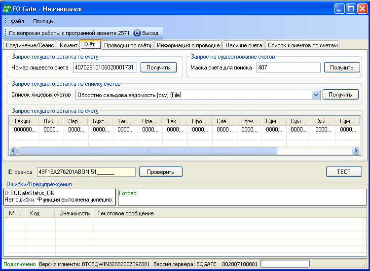
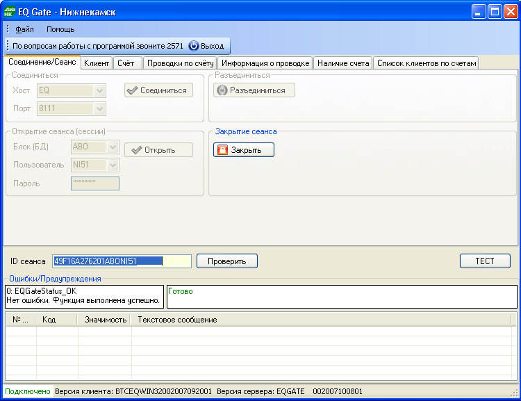

# DESI. EQ Gate #

DESI (data exchange system). EQ Gate - система обмена данными посредством API (библиотеки шлюза).

Info
----

Система обмена обмена данными между Progress (СУБД) и DB2 (СУБД) для автоматизированной банковской системы "Misys Equation" в двух реализациях: [github.com/Nazir/EqGate-2008][2] и [github.com/Nazir/DESI-2008][3].

Stack
-----
[C#], [.NET Framework 2], [Microsoft Visual Studio 2008].

Screenshots
-----------
Вкладка «Счёт»:

Вкладка «Соединение»:

Repo owner
----------
> Developer: Nazir K. Khusnutdinov
>
> Nazir (c) 2008
>
> Web: [github.com/Nazir][1]

[1]: https://github.com/Nazir
[2]: https://github.com/Nazir/EqGate-2008
[3]: https://github.com/Nazir/DESI-2008
